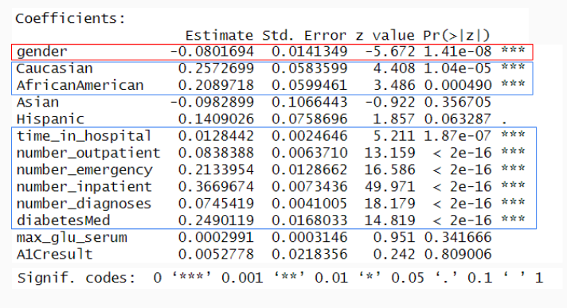

# UHTASI Data Science Competition
Made by [Meynard Ballesteros](https://github.com/Xerconia) and [Haoyuan Zhang](https://github.com/Travis-ZhangMYG)

## Data Science Diabetes Project
Our competition involves analyzing a real-world dataset to predict readmission among patients with a diabetic diagnosis. Additionally, we need to prepare a presentation that addresses the following questions:

* What is the most common primary diagnosis by age group?
* Explore the effect of a diabetes diagnosis on readmission rates.
* What groups of patients should the hospital focus their follow-up effots to better monitor patienst with a high probability of readmission?

### Criteria
1. Use the [original dataset](https://archive.ics.uci.edu/dataset/296/diabetes+130-us+hospitals+for+years+1999-2008) and explore if it provides any additional insights.
2. Presentation must be around 10 minutes that suuport your claims, insights, and recommendations, with active engagement, storytelling, and understandability for briefing decision makers.
3. Both partners must present.

Source for the **Competition** [Here](https://archive.ics.uci.edu/dataset/296/diabetes+130-us+hospitals+for+years+1999-2008).

## Overview
We opted for [RStudio](https://posit.co/products/open-source/rstudio/) as our development environment for analysis because we recognized R’s popularity among Data Scientists and Analysts. Our approach aligned with the four essential pillars of data analytics: descriptive, diagnostic, predictive, and prescriptive.

## Data
The original database contained **incomplete, redundant, and noisy** information. To do some data cleaning, we had to identify which features has missing/null values and how much were missing.

We also observed that the **key-value pairs** were initially stored in separate datasets. To address this, we merged them together, associating each pair with its corresponding names and descriptions.

The **ICD codes** we encountered were outdated, so we had to decipher the meaning of each code. Fortunately, we discovered a guideline that correlates each code with its corresponding **Diagnosis Related Group (DRG)**. This guideline provided valuable insights for accurate coding and reporting. Research can be found here, [/Research/icd9cm_guidelines_2011](https://github.com/UH-TASI/MBandHZ-DataScienceDiabetes/blob/main/Research/icd9cm_guidelines_2011.pdf)

## Analysis 
- [x] **What is the most common primary diagnosis by age group?**

To determine the most common primary diagnosis by age group, we’ll analyze the dataset. This involves identifying prevalent conditions among different age cohorts. For instance, we can explore whether certain age groups are more prone to specific diagnoses related to diabetes.

#### HeatMap of DRG Per AGE Group

- [x] **Explore the effect of a diabetes diagnosis on readmission rates.**

We’ll investigate how having a diabetes diagnosis impacts readmission rates. We developed both a logistic regression model and a neural network to evaluate the impact of diabetes. Our analysis involved comparing patients who were readmitted with those who were not.

#### Logistic Regression

#### Neural Network

## Conclusion

- [x] **What groups of patients should the hospital focus their follow-up effots to better monitor patienst with a high probability of readmission?**

Based on our conclusion we found that patients that have:
* High Amounts of inpatient/outpatient/emergency visits
* High Number of diagnoses
* Has a Diabetis medication
* High amounts of lab tests
* Older age
Have hight probability of readmission

Presentation [Here](https://github.com/UH-TASI/MBandHZ-DataScienceDiabetes/blob/main/Data%20Science%20Diabetes%20Presentation.pptx) to see more analysis and findings.

